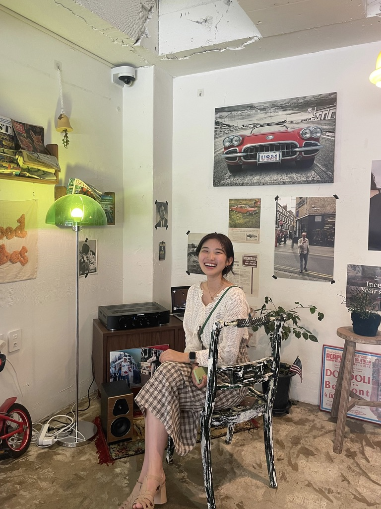
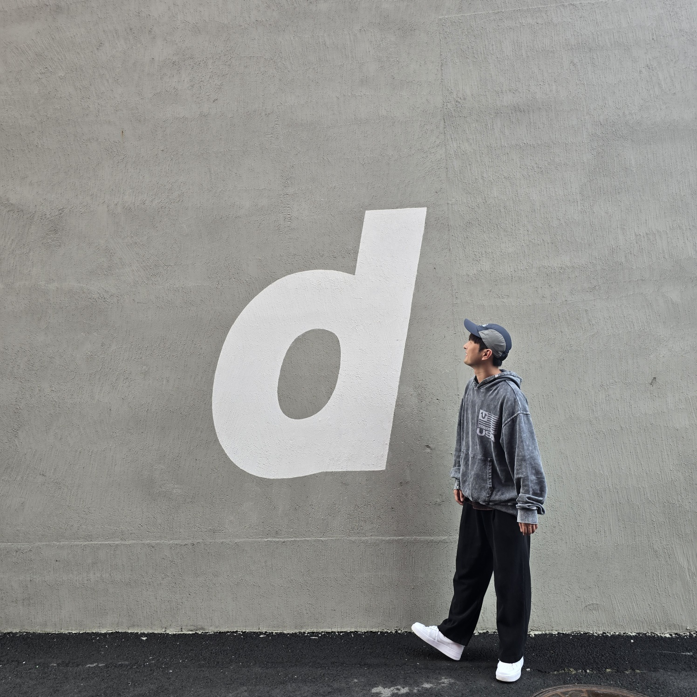
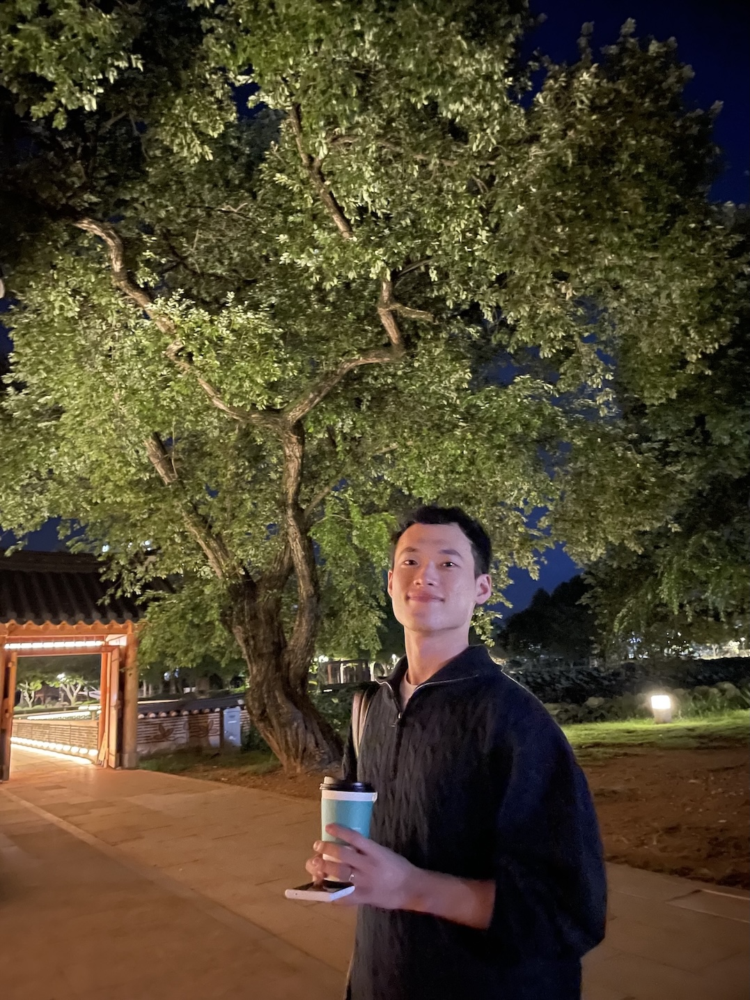

**☁️ 11기 구름톤 KEYWORD**

# [숨비소리] 제주 해녀 문화보존 프로젝트

제 11기 구름톤 **최우수상** - 숨비소리

- 배포 링크 | [https://www.sumbisori.site](https://www.sumbisori.site)
- 팀 구성 | `기획자` `디자이너` `프론트엔드 개발자` `백엔드 개발자`
- Tools | `Figma`
- Skills | `React` `Unity` `Spring boot` `MariaDB`
- 기수 | `11기`
- 구름톤 KEYWORD | `#제주도` `#클라우드` `#소셜임팩트`

## 프로젝트 진행 기간

`2024.10.29 ~ 진행중`

## 팀원 소개

|                                                                                                                                                                                  |                                                                                                                                                                                  |                                                                                                                                                                           |                                                                                                                                                                                   |                                                                                                                                                                           |
| :------------------------------------------------------------------------------------------------------------------------------------------------------------------------------: | :------------------------------------------------------------------------------------------------------------------------------------------------------------------------------: | :-----------------------------------------------------------------------------------------------------------------------------------------------------------------------: | :-------------------------------------------------------------------------------------------------------------------------------------------------------------------------------: | :-----------------------------------------------------------------------------------------------------------------------------------------------------------------------: |
|  **이예진**   Designer   [GitHub](https://github.com/ryejin5007)   [Email](mailto:ryejin5007@gmail.com) |  **제혜정**   P.M   [GitHub](https://github.com/JaneSnicket)   [Email](mailto:hyejeong2219@gmail.com) |  **최준**   Backend   [GitHub](https://github.com/junest66)   [Email](mailto:chlwndks33@naver.com) |  **김성용**   Frontend   [GitHub](https://github.com/yongseong2)   [Email](mailto:ancjs369@naver.com) |  **이용규**   Frontend   [GitHub](https://github.com/yeduk3)   [Email](mailto:yeduk33@gmail.com) |

---

# 🫧 숨비소리 Background

**🫧 숨비소리란?**

> 해녀가 잠수했다가 물에 떠오를 때, 숨을 내뱉는 소리를 칭합니다. 소멸해가는 소중한 해녀문화가 다시금 살아 숨쉴 수 있도록 접근성과 재방문율을 높여주는 해녀 체험 어시스턴트 서비스입니다.

## 문제 정의 Problem

### **#1. 고령화로 인한 인구 감소**

**`‘고령화’` 가 심각해지고 있는 상황에서 해녀 인구는 빠르게 감소하고 있습니다.**

해녀의 평균 연령이 70세를 넘어섰으며, 직업 특성상 높은 체력과 잠수 능력을 요구해 젊은 세대의 유입은 거의 이루어지지 않고 있습니다.

이로 인해 해녀 인력은 지속적으로 감소하고 있으며, 이는 제주 해녀 문화의 지속 가능성에 큰 위협이 됩니다. 더불어 해녀 직업에 대한 이해와 기술을 계승할 수 있는 인력이 부족해지면서 제주 해녀 문화가 사라질 가능성도 높아지고 있습니다.

### **#2. 고착화된 인식**

**사람들은 해녀가 직업적으로 많이 고된 작업이라는 `‘인식’` 을 가지고 있습니다.**

전통 방식으로 장비 없이 바다에서 해산물을 채취하는 일은 육체적으로도 힘들고 위험성이 높습니다. 이로 인해 \*\*\*\*젊은 세대는 해녀라는 직업을 선호하지 않습니다.

또한, 해녀들이 주로 해산물을 채취하는 계절에는 소득이 어느정도 있지만, 비수기에는 경제적 부담이 커지기 때문에 안정적인 수입원을 마련하기도 어려운 상황입니다.

### **#3. 비용에 대한 왜곡된 인식**

**체험 이용의 `‘비싼 비용’` 은 해녀 체험을 경험해보고자 하는 관광객들에게 부담이 됩니다.**

해녀 체험은 제주도 고유의 문화와 전통 및 역사적 가치를 느낄 수 있는 기회라고 느끼지만, 체험 프로그램 비용이 높다는 인식이 많아 관광객들이 쉽게 접근하기 어렵습니다.

## 숨비소리의 방향성 Directionality

### **#1. 젊은 세대의 유입**

**기존의 단순한 해녀 체험을 넘어, 하나의 문화로 자리잡을 수 있도록 합니다.**

쇠퇴하는 해녀 문화를 되살릴 방법은 젊은 세대의 지속적인 유입입니다. 해녀가 하나의 젊은 문화로서 자리를 잡게 되면 관련 일자리가 창출될 수 있습니다. 또한 교육 / 관광 / 요식업으로 확장되어 제주 지역 사회까지도 기여할 수 있습니다.

### **#2. 직업적 인식의 변화**

**해녀의 인식을 '고된 직업'에서 즐길 수 있는 ‘해양 스포츠’로 전환합니다.**

서핑 / 스노쿨링 / 스쿠버다이빙 / 낚시 등 많은 해양 스포츠들이 그렇듯, 처음 경험할 때에 어려움을 느끼지만 점차 익숙해지며 그 활동만의 매력을 느끼게 됩니다.

전통이나 문화유산을 체험한다는 다소 무겁고 어려운 주제로 느껴지기 보다는 다시금 체험하고 싶고 함께하고 싶은 문화로 자리잡기를 기대합니다.

### **#3. 해양 스포츠로서의 기능**

**제주 해녀 문화를 해양 스포츠로서 자리 잡을 수 있도록 합니다.**

앞서 언급한 서핑 / 스노쿨링 / 스쿠버다이빙 / 낚시 등의 해양 스포츠는 공간적 제약과 장비의 필요성이 있음에도 불구하고 사람들은 그 체험과 경험을 위해서 공간을 찾습니다. 해녀 체험도 이러한 제약들이 동일하게 작용하고 있지만 그 비용은 해양 스포츠들에 비해 상대적으로 저렴한 편입니다.

💡

**직업이 아닌, 하나의 경험이자 문화가 될 수 있도록 인식의 변화가 필요!**

해녀 체험이 제주 고유의 해양 스포츠로써 자리 잡아, 이 공간을 많은 사용자들이 찾기를 기대합니다.

보다 많은 사람들이 단발성이 아닌, 지속적으로 체험할 수 있는 서비스로 구축된다면, 해녀가 도전하기 어려운 직업에서 사용자에게 더 가깝게 경험하고 서로 나눌 수 있는 문화로 도약할 것입니다.

## 해녀 체험과 해양 스포츠 Benchmarking

제주 해녀 체험이 문화로 자리잡게 하기 위해, 비슷한 성격을 가진 해양 스포츠를 벤치마킹하여 적용합니다.

**#1. 스쿠버다이빙**

단순히 물속에서의 경험을 넘어 바다 생태계를 직접 관찰하고 자연과 교감할 수 있는 체험을 제공합니다. 다양한 해양 생태를 눈으로 보고 체험하는 점에서 해녀 체험과 유사합니다.

**#2. 낚시**

바다에서 해산물을 직접 채취하고 수집하는 활동으로, 해녀 체험이 해산물 채취라는 점에서 유사합니다.

🤿

**해양 스포츠의 유사성을 접목하여 해녀 체험을 문화로!**

## 해녀 체험의 특징 Point

### 1. **장비 없이 잠수**

최소한의 장비(물안경, 테왁 등)만을 사용하여 바다에 들어가 해산물을 채취합니다.

### 2. **합법적인 채취 방식**

스쿠버다이빙으로 해산물을 채취하는 것은 불법, 바닷 속 체류시간을 늘리는 공기통과 유도등 없이 채취하는 것은 합법입니다.

### 3. **해산물 채취 후 시식**

직접 바다에서 채취한 해산물을 요리하고 맛보며 제주 식문화와 해녀의 일상을 더 깊이 이해할 수 있습니다.

**바다 속 생태를 장비없이 보고 직접 채취해나가며 성취감을 느낄 수 있는 서비스 도입**

## 숨비소리의 사용자 Persona

## 퍼소나의 니즈 **Needs**

- 물개 유형

  - **기록이 귀찮음 ⇒ 도감 자동 등록**
  - **해산물 채취를 통한 성취감을 얻고자 함 ⇒ 기존 해양 스포츠와는 다르게 해녀체험을 통해 합법적 해산물 취득**

- 거북이 유형
  - **제주에서 즐기는 취미활동 ⇒ 해녀 체험으로 새로운 라이프 스타일 추구**
  - **제주도 여행 동선에 맞는 해양 활동 예약 ⇒ 해녀 체험 장소 확인 및 예약할 수 있는 기능**

## **숨비소리 Solution**

🔥 해녀 체험에 대한 접근성과 리텐션 올리기

> 기존에 단발성으로만 이루어져있던 해녀 체험을 만족감과 성취감을 주어 지속가능한 컨텐츠 구축
> 컨텐츠의 지속을 통한 문화가 만들어지기를 기대

## **서비스 소개 Introduction**

**숨비소리**는 평소 해양스포츠를 즐겨하는 이들에게 제주 해녀 체험을 해양문화로 즐길 수 있는 경험을 제공해요.

### 시연 영상

서비스 화면

로그인

---

메인화면

---

예약(지도)

예약(작성)

예약(완료)

---

마이페이지

예약정보 조회(체험 대기)

예약정보 조회(체험 완료)

---

도감 등록(전)

도감 등록(전)

도감 등록(후)

---

물질도감

물질도감(유)

물질도감(무)

## **핵심 기능** Function

### **1. 해녀체험 장소 확인 및 예약하기**

### **2. 채취한 해산물을 물질도감에 등록하기**

## **디자인 UX/UI DESIGN**

### **스타일 가이드 Style Guide**

## 개발 DEVELOPMENT

### **시스템 아키텍쳐 System Architecture**

### **프론트엔드 FRONTEND**

> **React, Typescript, Redux, Tailwind, Unity(React Unity WebGL)**

**React**

- 컴포넌트 구조를 활용하여 각 UI 요소를 재사용 가능한 구성 요소로 분리했어요.
- 외부 API와 비동기 통신을 구현하여 사용자 인터페이스와 데이터를 연동했어요.
- AWS amplify로 main 브랜치 코드 변화에 따라 자동 배포를 설정했어요.

**Tailwind**

- 클래스 기반으로 빠르고 유연하게 UI 스타일링을 구현했어요.
- 커스터마이징 기능을 이용해 [스타일 가이드](https://www.notion.so/136c7914b38c80db9152e8c046da24f4?pvs=21)에 맞는 색상 팔레트와 테마를 설정했어요.

**Unity**

- Unity를 WebGL로 빌드하여 메인 페이지 UI를 구성했어요.
- React Unity WebGL 패키지를 활용하여 React에서 Unity로 API 데이터를 전달했어요.
- 애니메이션과 터치 이벤트를 게임 엔진으로 구현하여 바다에서 헤엄치는 해산물과 상호작용할 수 있어요.

Unity를 활용한 화면

### 백엔드 Backend

> **Java17, Spring Boot 3, Spiring Data JPA, Querydsl ,Spring Security, MariaDB, Krampoline**

**Spring**

- Java 17 기반의 Spring Boot로 RESTful API를 개발했어요
- Spring Data JPA와 Querydsl을 사용해 데이터베이스와 원활히 상호작용했어요.
- Swagger를 사용해, API 명세서를 효율적으로 관리했어요.
- Flyway를 사용해, 데이터베이스 스키마의 형상관리를 했어요

**Spring Security**

- OAuth 2.0 이용해 카카오 로그인 기능을 구현했으며, 외부 API 통신을 위해 프록시 서버를 이용했어요.
- JWT 토큰 기반 인증을 구현하여 사용자의 로그인 상태를 유지하고 권한을 관리했어요

**Krampoline**

- Krampoline IDE를 이용하여 쿠버네티스 환경에서 배포를 진행했어요

## 🙌🏻 팀 소개 해남해녀

